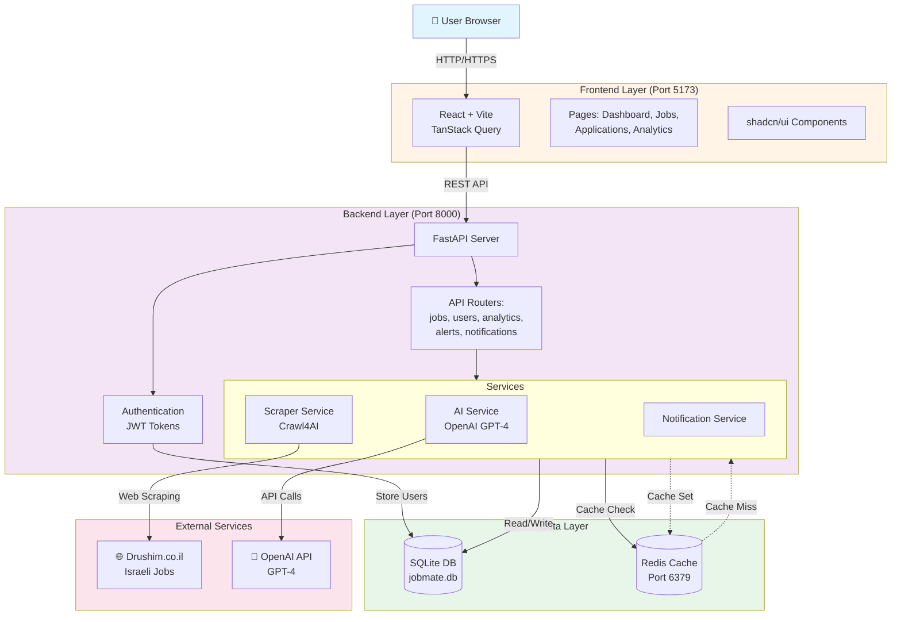

# JobMate AI - Local Development Guide

Complete guide to run all components of the JobMate AI system locally.

---

## Prerequisites

Before starting, ensure you have installed:

- **Python 3.9+** (`python3 --version`)
- **Node.js 18+** and npm (`node --version`)
- **Docker Desktop** (for Redis) (`docker --version`)
- **Git** (`git --version`)

---

## Quick Start (All Components)

```bash
# 1. Start Redis
docker-compose up -d redis

# 2. Start Backend (new terminal)
cd backend
REDIS_URL=redis://localhost:6379/0 /Users/alisaree/Desktop/JobMateAI/backend/venv/bin/python3.9 -m uvicorn app.main:app --reload --host 0.0.0.0 --port 8000

# 3. Start Frontend (new terminal)
npm run dev
```

Visit: **http://localhost:5173**

---

## Component 1: Redis Cache

### Option A: Docker (Recommended)

```bash
# Start Redis container
cd /Users/alisaree/Desktop/JobMateAI
docker-compose up -d redis

# Verify it's running
docker ps | grep redis

# Check logs
docker-compose logs redis

# Connect to Redis CLI
docker exec -it jobmate-redis redis-cli
> PING  # Should return PONG
> KEYS * # List all cached keys
> exit
```

### Option B: Local Redis Installation

```bash
# Install (macOS)
brew install redis

# Start Redis
redis-server

# In another terminal, test connection
redis-cli ping
```

**Default Port:** `6379`  
**Connection String:** `redis://localhost:6379/0`

### Stop Redis

```bash
# Docker
docker-compose stop redis

# Or remove completely
docker-compose down redis
```

---

## Component 2: Backend API (FastAPI)

### Initial Setup (One-time)

```bash
cd /Users/alisaree/Desktop/JobMateAI/backend

# Create virtual environment (if not exists)
python3.9 -m venv venv

# Activate virtual environment
source venv/bin/activate  # macOS/Linux

# Install dependencies
pip install -r requirements.txt

# Install Playwright browsers (for Crawl4AI)
playwright install chromium
```

### Environment Configuration

Create or update `.env` file in `/backend` directory:

```env
# Database
DATABASE_URL=sqlite:///./jobmate.db

# Redis Cache
REDIS_URL=redis://localhost:6379/0

# OpenAI API
OPENAI_API_KEY=sk-your-openai-api-key-here

# Security
SECRET_KEY=your-secret-key-change-in-production
ALGORITHM=HS256
ACCESS_TOKEN_EXPIRE_MINUTES=10080

# CORS
CORS_ORIGINS=http://localhost:5173,http://localhost:3000
```

### Run Backend

```bash
cd /Users/alisaree/Desktop/JobMateAI/backend

# Method 1: With environment variables
REDIS_URL=redis://localhost:6379/0 venv/bin/python3.9 -m uvicorn app.main:app --reload --host 0.0.0.0 --port 8000

# Method 2: Using .env file (if configured)
venv/bin/python3.9 -m uvicorn app.main:app --reload --host 0.0.0.0 --port 8000

# Method 3: Run in background
REDIS_URL=redis://localhost:6379/0 venv/bin/python3.9 -m uvicorn app.main:app --reload --host 0.0.0.0 --port 8000 > backend.log 2>&1 &
```

### Verify Backend is Running

```bash
# Check health
curl http://localhost:8000/health

# Check API docs
open http://localhost:8000/docs

# Check cache stats
curl http://localhost:8000/api/jobs/cache/stats | python3 -m json.tool
```

**Backend URL:** `http://localhost:8000`  
**API Documentation:** `http://localhost:8000/docs`  
**Redoc:** `http://localhost:8000/redoc`

### Stop Backend

```bash
# If running in foreground: Ctrl+C

# If running in background:
lsof -ti:8000 | xargs kill -9

# Or find process ID
ps aux | grep uvicorn
kill <PID>
```

---

## Component 3: Frontend (React + Vite)

### Initial Setup (One-time)

```bash
cd /Users/alisaree/Desktop/JobMateAI

# Install dependencies
npm install

# Or if you have issues
npm ci
```

### Environment Configuration

Create or update `.env` file in root directory:

```env
# Backend API URL
VITE_API_URL=http://localhost:8000
```

### Run Frontend

```bash
cd /Users/alisaree/Desktop/JobMateAI

# Development mode (hot reload)
npm run dev

# Access at http://localhost:5173
```

### Build for Production

```bash
# Create production build
npm run build

# Preview production build
npm run preview

# Build is in ./dist folder
```

**Frontend URL:** `http://localhost:5173`  
**Build Output:** `./dist`

### Stop Frontend

```bash
# If running in foreground: Ctrl+C

# If running in background:
lsof -ti:5173 | xargs kill -9
```

---

## Component 4: Database (SQLite)

### Default Setup

SQLite database is created automatically when backend starts.

**Location:** `/Users/alisaree/Desktop/JobMateAI/backend/jobmate.db`

### Database Operations

```bash
cd /Users/alisaree/Desktop/JobMateAI/backend

# View database
sqlite3 jobmate.db

# Inside SQLite CLI:
.tables                  # List all tables
.schema users           # View users table schema
SELECT * FROM users;    # Query users
.quit                   # Exit

# Backup database
cp jobmate.db jobmate_backup_$(date +%Y%m%d).db

# Reset database (caution!)
rm jobmate.db
# Restart backend - new DB will be created
```

### Migration Scripts

```bash
cd /Users/alisaree/Desktop/JobMateAI/backend

# Run migrations (if needed)
venv/bin/python migrate_to_postgres.py
venv/bin/python migrate_add_notes.py
venv/bin/python migrate_add_alerts_analytics.py
```

---

## System Architecture

### High-Level Overview



### Component Interactions

```
┌─────────────────────────────────────────────────────────────┐
│                         USER BROWSER                         │
│                     http://localhost:5173                    │
└────────────────────────────┬────────────────────────────────┘
                             │
                             │ REST API (JSON)
                             ▼
┌─────────────────────────────────────────────────────────────┐
│                    BACKEND API (FastAPI)                     │
│                     http://localhost:8000                    │
├──────────────────┬──────────────────┬───────────────────────┤
│   Authentication │   Job Scraping   │   AI Services         │
│   - JWT Tokens   │   - Crawl4AI     │   - Cover Letters     │
│   - User Mgmt    │   - Drushim      │   - Skill Matching    │
└────────┬─────────┴────────┬─────────┴───────────┬───────────┘
         │                  │                     │
         ▼                  ▼                     ▼
┌─────────────────┐  ┌──────────────┐   ┌────────────────┐
│  SQLite         │  │ Redis Cache  │   │ OpenAI API     │
│  - Users        │  │ - Job Lists  │   │ - GPT-4 Turbo  │
│  - Jobs         │  │ - 30min TTL  │   │ - Completions  │
│  - Applications │  │ - Stats      │   │                │
│  - Alerts       │  │              │   │                │
└─────────────────┘  └──────────────┘   └────────────────┘
```

### Data Flow: Israeli Jobs Scraping

```
1. User clicks "Security Jobs" → Frontend
2. Frontend → GET /api/jobs/scrape/drushim?url=... → Backend
3. Backend checks Redis cache for key "jobs:drushim:236"
   
   ┌─────────────────────────────────────┐
   │ CACHE HIT (30min)                   │
   └────────┬────────────────────────────┘
            │
            ▼
   Return cached jobs (< 100ms)
   
   ┌─────────────────────────────────────┐
   │ CACHE MISS                          │
   └────────┬────────────────────────────┘
            │
            ▼
   4. Crawl4AI scrapes Drushim.co.il (5-8 seconds)
   5. Extract 25+ jobs from listing page
   6. Store in Redis with 30min TTL
   7. Return jobs to frontend
   
8. Frontend displays jobs in cards
9. User clicks job → Modal shows full details (Hebrew RTL)
```

### Authentication Flow

```
Registration:
User → Frontend → POST /api/register → Backend
                                         ↓
                                    Hash password (bcrypt)
                                         ↓
                                    Store in SQLite
                                         ↓
                                    Return success

Login:
User → Frontend → POST /api/login → Backend
                                      ↓
                                 Verify credentials
                                      ↓
                                 Generate JWT token
                                      ↓
                                 Return token

Authenticated Request:
Frontend → GET /api/jobs (with Bearer token) → Backend
                                                  ↓
                                             Verify JWT
                                                  ↓
                                             Process request
                                                  ↓
                                             Return data
```

### Caching Strategy

```
┌──────────────────────────────────────────────────────────┐
│                    Request Flow                          │
└────────────────────────┬─────────────────────────────────┘
                         │
                         ▼
              ┌──────────────────┐
              │ Check Redis      │
              │ Key: jobs:src:id │
              └────────┬─────────┘
                       │
           ┌───────────┴───────────┐
           │                       │
    ┌──────▼──────┐         ┌─────▼──────┐
    │ CACHE HIT   │         │ CACHE MISS │
    │ (found)     │         │ (not found)│
    └──────┬──────┘         └─────┬──────┘
           │                      │
           │                      ▼
           │              ┌───────────────┐
           │              │ Scrape Web    │
           │              │ (5-8 seconds) │
           │              └───────┬───────┘
           │                      │
           │                      ▼
           │              ┌───────────────┐
           │              │ Store in Redis│
           │              │ TTL: 30 min   │
           │              └───────┬───────┘
           │                      │
           └──────────────────────┘
                         │
                         ▼
              ┌──────────────────┐
              │ Return Data      │
              │ Response Time:   │
              │ Hit: <100ms      │
              │ Miss: 5-8 sec    │
              └──────────────────┘
```

### Technology Stack

**Frontend:**
- React 18 (UI framework)
- Vite (build tool, hot reload)
- TanStack Query (data fetching, caching)
- shadcn/ui (component library)
- Tailwind CSS (styling)
- Recharts (analytics charts)

**Backend:**
- FastAPI (web framework)
- Uvicorn (ASGI server)
- Pydantic (data validation)
- SQLAlchemy (ORM)
- Crawl4AI 0.3.746 (web scraping)
- Playwright (browser automation)
- bcrypt (password hashing)
- PyJWT (authentication)

**Data & Cache:**
- SQLite (primary database)
- Redis 7 (cache layer)
- redis-py (Python client)

**AI Services:**
- OpenAI GPT-4 Turbo (cover letters, matching)

**Infrastructure:**
- Docker & Docker Compose (containerization)
- Nginx (production reverse proxy)

### File Structure

```
JobMateAI/
├── backend/                    # FastAPI Backend
│   ├── app/
│   │   ├── routers/           # API endpoints
│   │   │   ├── jobs.py        # Job scraping, caching
│   │   │   ├── users.py       # Auth, registration
│   │   │   ├── analytics.py   # User stats
│   │   │   └── alerts.py      # Job alerts
│   │   ├── services/          # Business logic
│   │   │   ├── scrapers.py    # DrushimScraper
│   │   │   ├── cache.py       # Redis cache service
│   │   │   ├── ai.py          # OpenAI integration
│   │   │   └── notifications.py
│   │   ├── models.py          # SQLAlchemy models
│   │   ├── schemas.py         # Pydantic schemas
│   │   ├── database.py        # DB connection
│   │   ├── config.py          # Settings
│   │   └── main.py            # FastAPI app
│   ├── requirements.txt       # Python deps
│   └── Dockerfile
│
├── src/                        # React Frontend
│   ├── pages/                 # Route pages
│   │   ├── Dashboard.jsx      # Main dashboard
│   │   ├── Jobs.jsx           # Job search
│   │   ├── IsraeliJobs.jsx    # Israeli jobs (NEW)
│   │   ├── Applications.jsx   # Application tracker
│   │   └── Analytics.jsx      # Stats & charts
│   ├── components/            # Reusable components
│   │   ├── jobs/
│   │   │   ├── JobCard.jsx
│   │   │   └── JobFilters.jsx
│   │   └── ui/                # shadcn components
│   ├── api/                   # API client
│   │   └── jobmate.js         # Backend calls
│   ├── lib/                   # Utilities
│   │   └── AuthContext.jsx    # Auth state
│   └── main.jsx               # App entry
│
├── docker-compose.yml         # Local dev setup
├── Dockerfile                 # Frontend production
├── package.json               # Node dependencies
├── vite.config.js             # Vite config
├── tailwind.config.js         # Tailwind config
│
└── Documentation/
    ├── RUNNING_GUIDE.md       # This file
    ├── AZURE_DEPLOYMENT.md    # Cloud deployment
    ├── DOCKER_QUICKSTART.md   # Docker setup
    └── ARCHITECTURE.md        # System design
```

---

## Common Commands

### Check What's Running

```bash
# Check ports
lsof -i :6379  # Redis
lsof -i :8000  # Backend
lsof -i :5173  # Frontend

# Check Docker containers
docker ps

# Check processes
ps aux | grep uvicorn    # Backend
ps aux | grep vite       # Frontend
ps aux | grep redis      # Redis
```

### Kill All Components

```bash
# Kill backend
lsof -ti:8000 | xargs kill -9

# Kill frontend
lsof -ti:5173 | xargs kill -9

# Stop Redis
docker-compose stop redis

# Or kill all node/python processes (careful!)
pkill -f uvicorn
pkill -f vite
```

### View Logs

```bash
# Backend logs (if running in background)
tail -f /Users/alisaree/Desktop/JobMateAI/backend/backend.log

# Redis logs
docker-compose logs -f redis

# Frontend logs
# (usually in the terminal where npm run dev is running)
```

---

## Testing Components

### Test Backend

```bash
# Health check
curl http://localhost:8000/health

# Test user registration
curl -X POST http://localhost:8000/api/register \
  -H "Content-Type: application/json" \
  -d '{"email":"test@example.com","password":"test123","full_name":"Test User"}'

# Test scraping (requires backend running)
curl "http://localhost:8000/api/jobs/scrape/drushim?url=https://www.drushim.co.il/jobs/subcat/236"
```

### Test Frontend

Open browser: `http://localhost:5173`

- Check if login page loads
- Try to register/login
- Navigate to different pages

### Test Redis Cache

```bash
# Check cache stats
curl http://localhost:8000/api/jobs/cache/stats

# Clear cache
curl -X DELETE http://localhost:8000/api/jobs/cache/clear

# Connect to Redis and check keys
docker exec -it jobmate-redis redis-cli
> KEYS jobs:*
> GET jobs:drushim:236
```

---

## Troubleshooting

### Redis Not Connecting

```bash
# Check if Redis is running
docker ps | grep redis

# Restart Redis
docker-compose restart redis

# Check Redis logs
docker-compose logs redis

# Test connection
docker exec -it jobmate-redis redis-cli ping
```

**Symptom:** Backend says "Using in-memory cache"  
**Solution:** Ensure Redis is running on port 6379

### Backend Won't Start

```bash
# Check if port 8000 is in use
lsof -i :8000

# Kill process using port
lsof -ti:8000 | xargs kill -9

# Check Python version
which python3.9
python3.9 --version

# Reinstall dependencies
cd backend
pip install -r requirements.txt --force-reinstall
```

### Frontend Won't Start

```bash
# Clear node_modules and reinstall
rm -rf node_modules package-lock.json
npm install

# Try different port
npm run dev -- --port 3000

# Check Node version
node --version  # Should be 18+
```

### Database Issues

```bash
# Reset database
cd backend
rm jobmate.db
# Restart backend - new DB created

# Check database file
ls -lh jobmate.db
sqlite3 jobmate.db ".tables"
```

### Module Not Found Errors

```bash
# Backend
cd backend
source venv/bin/activate
pip install -r requirements.txt

# Frontend
cd /Users/alisaree/Desktop/JobMateAI
npm install
```

---

## Development Workflow

### Daily Startup

```bash
# Terminal 1: Redis
docker-compose up -d redis

# Terminal 2: Backend
cd backend
REDIS_URL=redis://localhost:6379/0 venv/bin/python3.9 -m uvicorn app.main:app --reload --host 0.0.0.0 --port 8000

# Terminal 3: Frontend
npm run dev
```

### Daily Shutdown

```bash
# Stop frontend (Ctrl+C in Terminal 3)
# Stop backend (Ctrl+C in Terminal 2)

# Stop Redis
docker-compose stop redis
```

### Making Changes

**Backend changes:**
- Edit files in `backend/app/`
- Auto-reloads with `--reload` flag
- Check `http://localhost:8000/docs` for API changes

**Frontend changes:**
- Edit files in `src/`
- Hot module replacement (instant updates)
- Check browser console for errors

**Database changes:**
- Create migration script in `backend/`
- Run migration
- Restart backend

---

## Performance Monitoring

### Check Cache Performance

```bash
# Cache stats
curl http://localhost:8000/api/jobs/cache/stats | jq

# Monitor Redis in real-time
docker exec -it jobmate-redis redis-cli
> MONITOR
# See all commands being executed
```

### Check API Performance

```bash
# Time an API request
time curl -s "http://localhost:8000/api/jobs/scrape/drushim?url=https://www.drushim.co.il/jobs/subcat/236" > /dev/null

# First request: ~5-8 seconds (scraping)
# Second request: <0.1 seconds (cached)
```

---

## Environment Variables Reference

### Backend (.env in /backend)

| Variable | Description | Default |
|----------|-------------|---------|
| `DATABASE_URL` | Database connection string | `sqlite:///./jobmate.db` |
| `REDIS_URL` | Redis connection string | `redis://localhost:6379/0` |
| `OPENAI_API_KEY` | OpenAI API key | Required |
| `SECRET_KEY` | JWT secret key | Required |
| `ALGORITHM` | JWT algorithm | `HS256` |
| `ACCESS_TOKEN_EXPIRE_MINUTES` | Token expiry | `10080` (7 days) |
| `CORS_ORIGINS` | Allowed CORS origins | `http://localhost:5173` |

### Frontend (.env in root)

| Variable | Description | Default |
|----------|-------------|---------|
| `VITE_API_URL` | Backend API URL | `http://localhost:8000` |

---

## Next Steps

- **Deploy to Production:** See [AZURE_DEPLOYMENT.md](AZURE_DEPLOYMENT.md)
- **Docker Full Stack:** See [DOCKER_QUICKSTART.md](DOCKER_QUICKSTART.md)
- **API Documentation:** Visit http://localhost:8000/docs when running

---

## Support

For issues or questions:
1. Check the troubleshooting section above
2. Review logs: `backend/backend.log` or terminal output
3. Check API docs: http://localhost:8000/docs
4. Verify all components are running: `lsof -i :6379 && lsof -i :8000 && lsof -i :5173`
